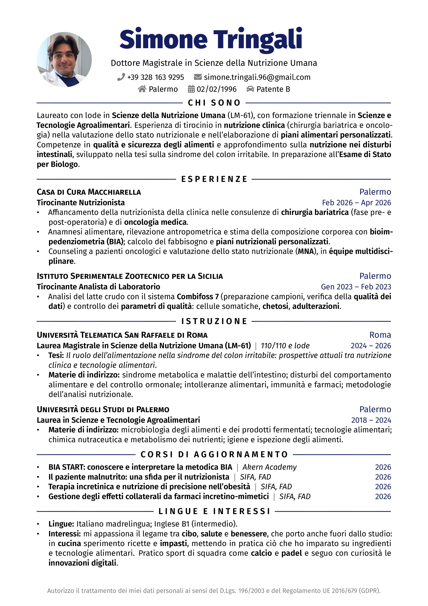

# Rover Resume - CV in LaTeX a Singola Pagina

v2.0 (06 ottobre 2026) di Simone Tringali

[Per la versione inglese Clicca Qui](https://github.com/SimoneTringali96/LaTeX_resume/tree/ENG)

## Introduzione

Questo repository è pensato per te, amante di LaTeX, per darti un'idea interessante per un curriculum vitae.
Puoi utilizzare questo modello per creare in pochi minuti il tuo curriculum personale.

Di seguito troverai una selezione di passi da seguire per personalizzare il tuo curriculum, divertiti.
Per qualsiasi domanda puoi scrivermi a [simone.tringali.96@gmail.com](mailto:simone.tringali.96@gmail.com).

Puoi trovarmi anche su:

[](https://www.instagram.com/simone_tringali/)

## Aspetto del Curriculum

Puoi [scaricare il PDF](./Simone_Tringali_CV_ITA.pdf) oppure dare un'occhiata all'anteprima:



## Editor

Nel caso tu non conosca LaTeX, non preoccuparti, puoi utilizzare [Overleaf](https://overleaf.com), un editor online gratuito e fantastico,
basta creare un account, avviare un nuovo progetto e caricare i file di questo repository.

Per avere i file sul tuo PC, clona semplicemente questo repository:

1. Seleziona la posizione in cui desideri memorizzare il file nel tuo terminale

   ```bash
   cd Progetti/curriculum
   ```

2. Clona il repository

   ```bash
   git clone https://github.com/SimoneTringali96/LaTeX_resume.git
   ```

Dopo aver caricato i file, dovrai solo modificare il contenuto dei file per scrivere ciò che desideri nel tuo curriculum.
È davvero intuitivo, nel caso tu abbia bisogno di ulteriori informazioni su cosa modificare, puoi consultare la sezione seguente.

## Come personalizzarlo

- Tutto il curriculum si trova nel file `Simone_Tringali_CV_ITA.tex`.
- Nome, titolo e contatti si modificano nella parte del file indicata come `BANNER`.
- Per cambiare la foto sostituisci `sagoma.jpeg` con la tua, possibilmente quadrata. Se preferisci un curriculum senza foto, commenta il blocco indicato nel file.
- Per cambiare il colore principale modifica la riga `\definecolor{accent}` all'inizio del file.
- Compila con pdfLaTeX, che su Overleaf è già l'impostazione predefinita.
- Il template è basato sulla versione di [Emanuele Seminara](https://github.com/EmanueleSeminara/LaTeX_resume), a sua volta derivata da [Rover Resume](https://github.com/subidit/rover-resume).
