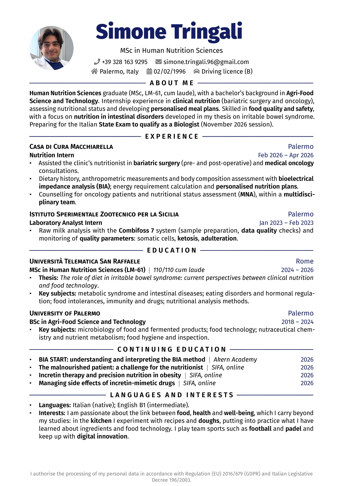

# Rover Resume - Single Page LaTeX CV

v2.0 (06 October 2026) by Simone Tringali

[For the Italian version Click Here](https://github.com/SimoneTringali96/LaTeX_resume/tree/ITA)

## Introduction

This repository is made for you, LaTeX lover, to give you an interesting idea for a curriculum vitae.
You can use this template to create your own resume in a few minutes.

Below you will find a few steps to follow to customise your resume, have fun.
For any question you can write me at [simone.tringali.96@gmail.com](mailto:simone.tringali.96@gmail.com).

You can also find me on:

[](https://www.instagram.com/simone_tringali/)

## Resume Preview

You can [download the PDF](./Simone_Tringali_CV_ENG.pdf) or take a look at the preview:



## Editor

If you don't know LaTeX, don't worry, you can use [Overleaf](https://overleaf.com), a free and fantastic online editor:
just create an account, start a new project and upload the files of this repository.

To get the files on your computer, just clone this repository:

1. Choose where you want to store the files in your terminal

   ```bash
   cd Projects/resume
   ```

2. Clone the repository

   ```bash
   git clone https://github.com/SimoneTringali96/LaTeX_resume.git
   ```

After uploading the files, you only need to edit their content to write what you want in your resume.
It is really intuitive; if you need more information about what to change, see the section below.

## How to customise it

- The whole resume is in the file `Simone_Tringali_CV_ENG.tex`.
- Name, title and contact details are in the part of the file marked `BANNER`.
- To change the photo, replace `sagoma.jpeg` with your own, ideally square. If you prefer a resume without a photo, comment out the block indicated in the file.
- To change the main colour, edit the `\definecolor{accent}` line at the top of the file.
- Compile with pdfLaTeX, which is already the default on Overleaf.
- The template is based on the version by [Emanuele Seminara](https://github.com/EmanueleSeminara/LaTeX_resume), itself derived from [Rover Resume](https://github.com/subidit/rover-resume).
