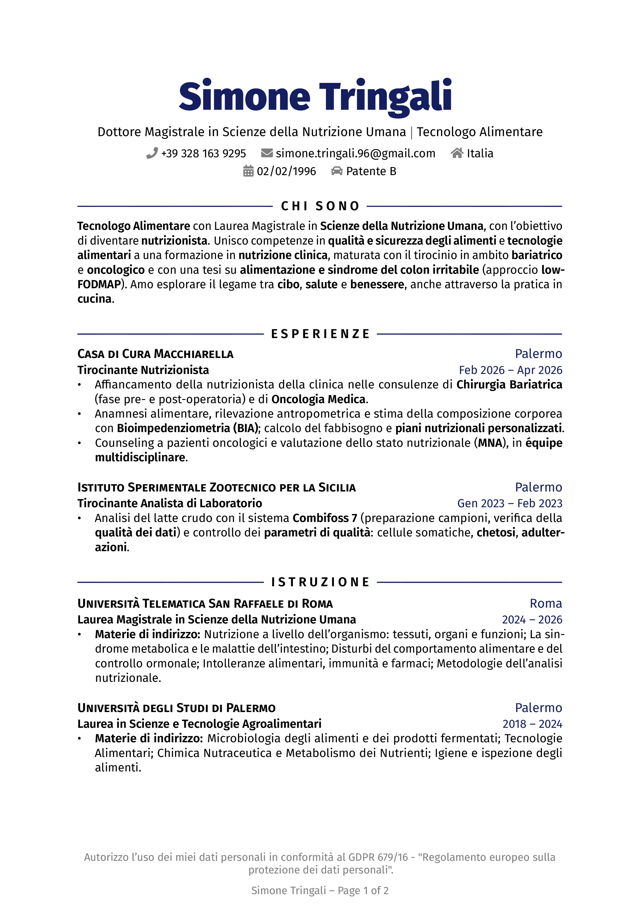
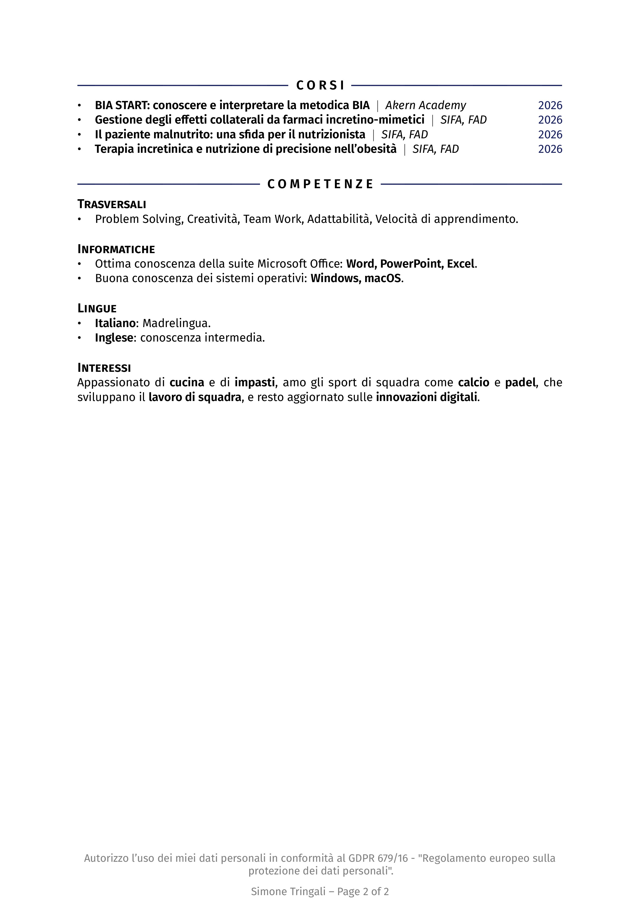

# Rover Resume - CV in LaTeX

v2.0 (06 ottobre 2026) di Simone Tringali

[Per la versione inglese Clicca Qui](https://github.com/SimoneTringali96/LaTeX_resume/tree/ENG)

## Introduzione

Questo repository è pensato per te, amante di LaTeX, per darti un'idea interessante per un curriculum vitae.
Puoi utilizzare questo modello per creare in pochi minuti il tuo curriculum personale.

Il template è basato sulla versione di [Emanuele Seminara](https://github.com/EmanueleSeminara/LaTeX_resume),
a sua volta fork di [Rover Resume](https://github.com/subidit/rover-resume), successivamente personalizzato nella struttura e nello stile.

Per qualsiasi domanda puoi scrivermi a [simone.tringali.96@gmail.com](mailto:simone.tringali.96@gmail.com).

Puoi trovarmi anche su:

[](https://www.instagram.com/simone_tringali/)

## Aspetto del Curriculum

Puoi [scaricare il PDF compilato](./Simone_Tringali_CV_ITA.pdf) oppure dare un'occhiata all'anteprima:




## Come iniziare

Per avere i file sul tuo PC, clona semplicemente questo repository:

1. Seleziona la posizione in cui desideri memorizzare il file nel tuo terminale

   ```bash
   cd Progetti/curriculum
   ```

2. Clona il repository

   ```bash
   git clone https://github.com/SimoneTringali96/LaTeX_resume.git
   ```

Dopo aver caricato i file, ti basta modificarne il contenuto per scrivere ciò che desideri nel tuo curriculum.
È davvero intuitivo: i commenti all'inizio del file `.tex` spiegano i comandi personalizzati usati dal template.

## Compilazione

Il template è pensato per **pdfLaTeX** e utilizza `fontenc` con codifica T1: è necessaria affinché le lettere accentate
vengano estratte correttamente dal PDF, aspetto rilevante per i sistemi ATS che leggono automaticamente i curriculum.

Per compilare in locale serve una distribuzione LaTeX presente nel PATH di sistema. Su macOS puoi installare
[MacTeX](https://www.tug.org/mactex/mactex-download.html), scaricando `MacTeX.pkg` dalla pagina di download.
Per altri sistemi operativi, o per alternative più leggere, fai riferimento alla
[documentazione di TeX Live](https://www.tug.org/texlive/).

Se usi Visual Studio Code, l'estensione [LaTeX Workshop](https://marketplace.visualstudio.com/items?itemName=James-Yu.latex-workshop)
gestisce la compilazione automaticamente una volta installata la distribuzione.

In alternativa, se non vuoi installare nulla, puoi usare [Overleaf](https://overleaf.com): un editor online gratuito,
basta creare un account, avviare un nuovo progetto e caricare i file di questo repository.
